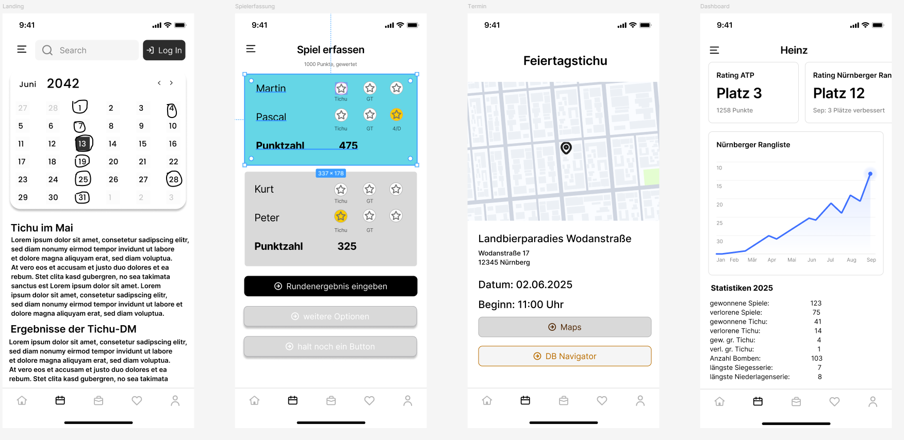

# tichu-app
Aus den Erfahrungen der deutschen Tichu Meisterschaft 2025 heraus soll folgendes Projekt entstehen:
Eine App die es ermöglicht, dass an jedem Tisch eine digitale Mitschrift der Ergebnisse für Turniere erfolgt. In weiteren Schritten kann ein Ausbau der App für die Nürnberger Rangliste, oder Community Anwendungen wie Kalender, News oder ähnlichem erfolgen.

## Anforderungen:
### Must-haves
 - Login-Bereich und Registrierung
 - Erfassung für Ergebnisse am mobilen Endgerät, Ausbaustufe auch als Desktopanwendung
 - Übermittlung der Ergebnisse nach Abschluss einer Runde
 - zentrale Erfassung der Ergebnisse und Erstellung von Statistiken
 - Erstellung von Turnierbäumen und Übermittlung der Partien an die beteiligten, registrierten Nutzer
 - Desktopanwendung für die Turnierleitung

### Could-haves
 - Anzeige der Statistiken in der App
 - Einpflegen eines Kalenderfunktion in die App, die Turniere und andere Veranstaltungen anzeigt (möglicher Entfernungsfilter für alle Kategorien: DM, Turnier, Tichutreffen)
 - Newsübersicht: neue Turniere, neue regelmäßige Treffen, ... (optional Push-Up für die gewählten Entfernungskategorien)
 - Detailseiten zu Kalendereinträgen mit Ort, Anfahrtskizze, Beginn, Format, Kosten, Preisen, evtl. Link zur Locationhomepage (Speisekarte), iCalender Export

### Überlegungen:
 - posten einzelner Spiele: am Ende eines Spiels, alle Appuser, die am Spiel beteiligt waren, bekommen Pushnachricht und können widersprechen; offline Modus: Spiele können beliebig 

### Entwurf

## Detailierter Entwurf

### Datenbank
 - User (user_id, e_mail, first_name, last_name, password_hash, created_at, last_active_at, location_id, user_type_id)
 - user_type (user_type_id, user_type)
 - Location (location_id, location_name, street, number, zipcode, city, geodata_x, geodata_y, homepage)
 - Tournament (tournament_id, date, start_time, number_of_rounds, format, location_id, tournament_director_id, description)
 - Game (game_id, date, start_time, format, id_player_1, id_player_2, id_player_3, id_player_4, id_player_5, tournament_id, tournament_round, reporting_user_id, validating_user_id)
 - Game_round (game_round_id, game_id, id_player_1, id_player_2, id_player_3, id_player_4, points_1_2, points_3_4, tichu_player_1, tichu_fulfilled_1, tichu_player_2, tichu_fulfilled_2, tichu_player_3, tichu_fulfilled_3, tichu_player_4, tichu_fulfilled_4)
 - Bomb (bomb_id, user_id, game_round_id, length, highcard)

### App
 - lokaler Zwischenspeicher für nicht abgeschickte Spiele
   (JSON: {"user_id": ID; "format" ID; "player_count" number; "id_player_1" ID; "id_player_2" ID; "id_player_3" ID; "id_player_4" ID; "id_player_5" ID; Round_1: {"id_player_1" ID; "id_player_2" ID; "id_player_3" ID; "id_player_4" ID; "points_team_1": number; "player_nt": list of up to 4 numbers; "player_gt": list of up to 4 numbers; finished_first: player_ID}; ...; Bomb_1 {round: number; player: ID; length: number; highcard: str}

